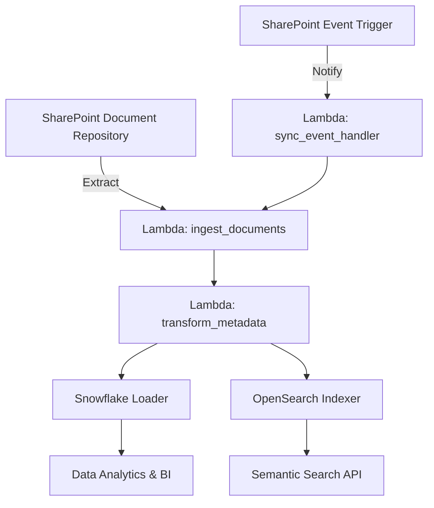

# Architecture

This project implements an enterprise knowledge data platform with the following architecture:

1. SharePoint documents are collected by the ingestion Lambda.
2. Documents are transformed, normalized, and metadata is extracted.
3. Snowflake stores the structured document catalog and analytics-ready tables.
4. OpenSearch indexes embeddings for semantic retrieval and similarity search.
5. Event-driven updates keep the platform synchronized with SharePoint changes.

## Components

- **SharePoint ingestion**: Python client extracts files, metadata, and document text.
- **AWS Lambda workflows**: Serverless functions for ingestion, transformation, and sync.
- **Snowflake**: Centralized data warehouse for analytics and business intelligence.
- **OpenSearch**: Vector search engine for semantic retrieval and recommendation.

## Data Flow

## Design Goals

- Scalability: modular Lambda functions and Snowflake-backed storage.
- Performance: optimized ingestion and retrieval flows reduce latency.
- Extensibility: supports additional sources and semantic pipelines.

## Deployment

Use AWS Serverless Framework, AWS SAM, or CloudFormation with the included `serverless.yml` manifest.
